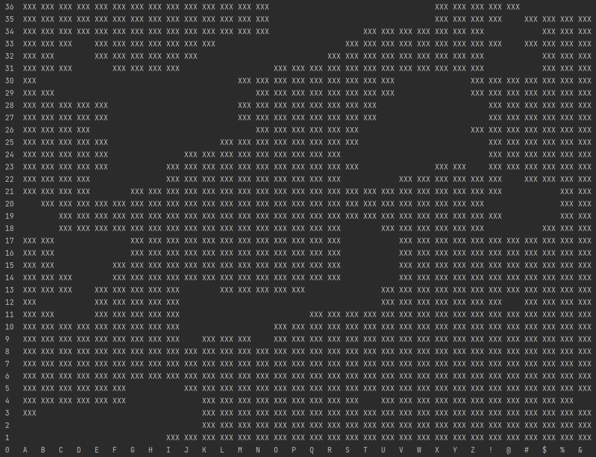

# HEIGHTMAP_GENERATOR
A heightmap generator using python
The program offers the following options:
* Generate new map
* Read and print existing map (csv)
* Save generated map (csv)
* Example map generated

----
